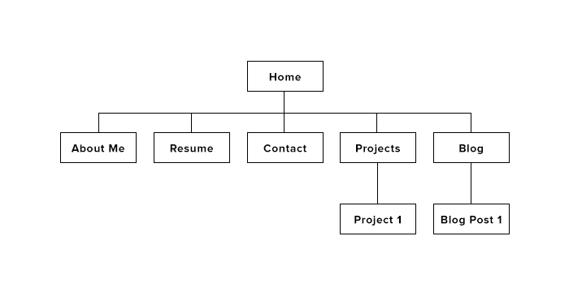

####What are the 6 Phases of Web Design?
The six phases of web design are:

1) Information Gathering

During the first phase of web design, it is essential to gather as much information as you can about your personal aspirations and goals with this website. This phase can be accomplished by asking deep questions about the person or company that is behind the website (this might be yourself!). It's important to have this comprehensive understanding before the other phases of web design so that the web site can be built with direction.
Some examples of questions that you might ask yourself to walk through this phase would be:

```
What is the purpose of this website?
What goals do you wish to accomplish by building this website?
Is there a specific person or group that can help you accomplish your goals? or Who is your target audience?
What kind of information do you want to display to your target audience?
```

2) Planning

The second phase of web design is where you will plan the structure of your website using a site map and decide what kind of technologies you will use on your website. This phase is important so that you will have a clear understanding of the flow and structure of the website before building it (so that you won't just wing it!).

At this stage, you will have to reflect on the purposes of your website and consider the appropriate technologies that you might need to employ to fulfill that site feature. If, for example, you simply want a blog, you might want to consider using CMS (content management systems) to make curating and maintenance of the site easy. Some CMS you'd might want to consider for this would be Wordpress, Drupal, or even Tumblr. 

In seeking out more sophisticated features and goals, such as processing user data or storing files, the technological part of planning will be essential.

3) Design

At the third phase of web design, it is important to begin figuring out the "look and feel" of the website. This phase will reflect on the cumulative knowledge that you have gained thus far in order to take every factor important to design into consideration. This phase might be a bit more abstract and subjective than the other phases, since you will have to consider what sort of design might look best for your target audience and convey the ability to accomplish its intended goals.

For example, when creating a security or privacy oriented website, it will be important to consider what privacy-oriented users would consider as good privacy-first design.


4) Development

At the fourth stage of web design, the website itself will be built. In this stage, the site will be created using the prototype created in the design stage to built a complete website that will reflect the plans and goals of phase 1 and 2.

Development typically is done with the homepage first. Then a template for the rest of the interior pages will be created so that the rest of the pages for the site can be easily created by following this template. This ensures that the site follows the same look and feel that was intended for each page.

5) Testing and Delivery

The fifth stage of web design is the point at which you will test the website and then deliver it to be available to your intended audience. Testing is essential for the website to perform as intended for different browsers and different devices. Even small features and pieces of the website that might seem small should be tested to ensure that the website will perform the necessary features for your audience when the time comes. The final piece of this phase is to deliver the website by uploading it to the actual server that hosts it.

6) Maintenance

The last stage of web design is maintenance. This phase should become a continually evolving process of building new content and offering new features for visitors. As far as how much maintenance is needed for a website is up to you as the developer to reflect on what is necessary to accomplish your goals from phase 1.

####What is your site's primary goal or purpose? What kind of content will your site feature?
The primary purpose behind my site is to act as a portfolio of my projects to be displayed to potential employers or anybody who would like to work with me on a project.  My goal is to seek out employment as a developer by the end of Dev Bootcamp and work with amazing people.

My site will feature a short summary of who I am personally and professionally, a picture of myself, my resume, my blog, and my projects. The site will focus particularly on showcasing my projects as a display of my skill as a developer.

####What is your target audience's interests and how do you see your site addressing them?

My target audience will be interested in recruiting developers or seeking out potential partners for future development projects. I see my site addressing them by welcoming them to look at the work that I have done in my projects. I believe that by having a clean looking website with a user experience that flows well throughout the entire website, I can impress employers and interest them in the work that I've done throughout DBC and beyond.

####What is the primary "action" the user should take when coming to your site? Do you want them to search for information, contact you, or see your portfolio? It's ok to have several actions at once, or different actions for different kinds of visitors.

The primary actions that users coming to my site should be to:

1. See my portfolio
2. Seek out information about my work (Through Google or through any of my social media pages)
3. Contact me

In these three actions, I am hope that I can interest users to be interested in my work and my skill set. The first and second actions are steps that I would hope will lead to getting in touch with me.

####What are the main things someone should know about design and user experience?

UX allows you to prioritize aspects of projects based on a user-centric design. By keeping user experience in mind when building a website, you can ensure that your site will welcome the intended audience to its primary features.

I think its important to also note that the results of good design and user experience might not be directly measurable. While increases in traffic to a webpage may be measurable, quantitative measures may not be directly linked with user experience changes due to how subjective the field is.

####What is user experience design and why is it valuable? 

User experience describes the way a person feels when they use a website or app. It's important for developers and designers because it allows teams to think from a user-centric vantage point to focus on what makes sense to guide users through the flow of the site.

####Which parts of the challenge did you find tedious?

I found writing the reflection to be a bit tedious since I wanted to make sure that I reflected on this challenge thoroughly.
