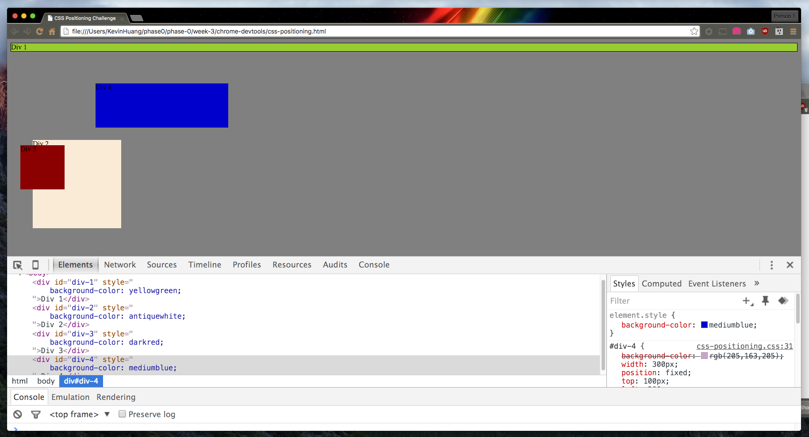
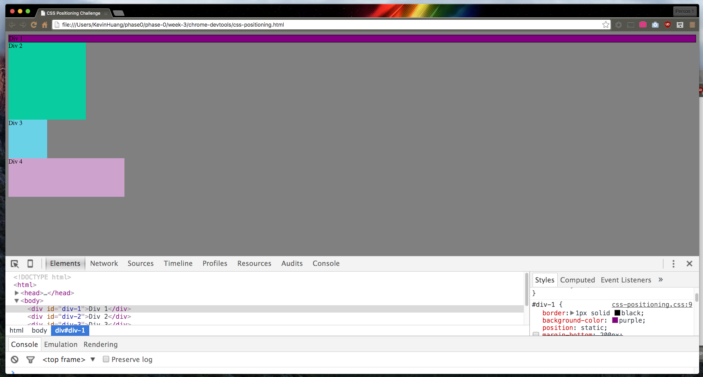
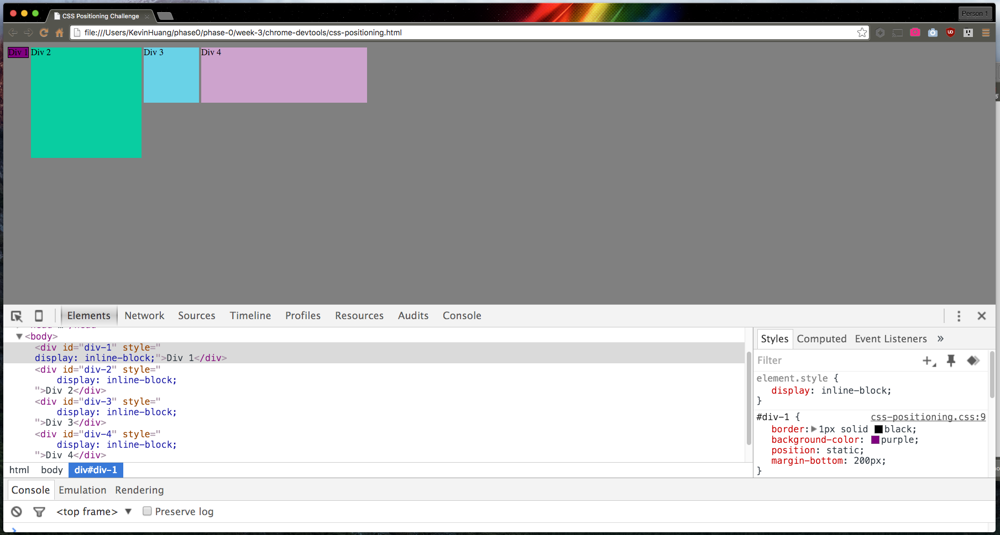
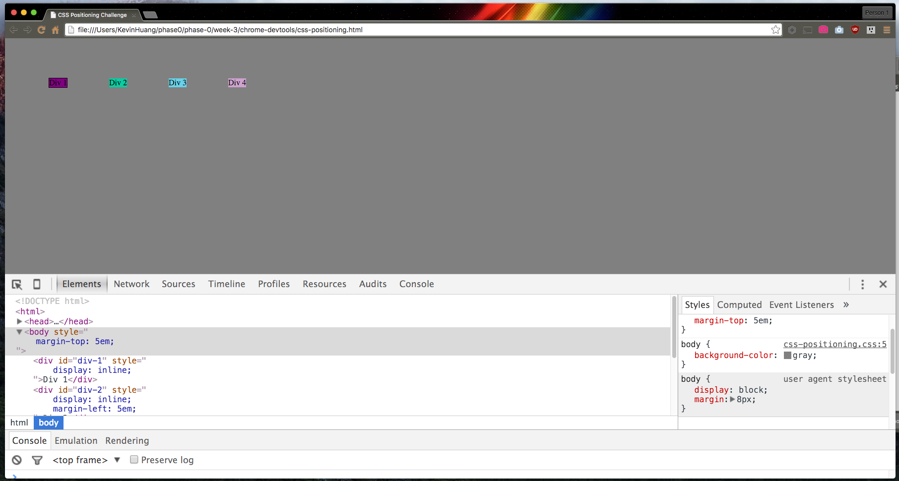
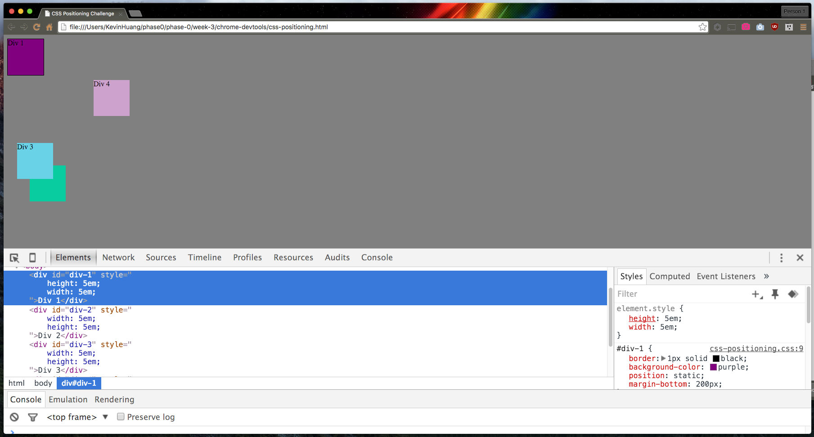
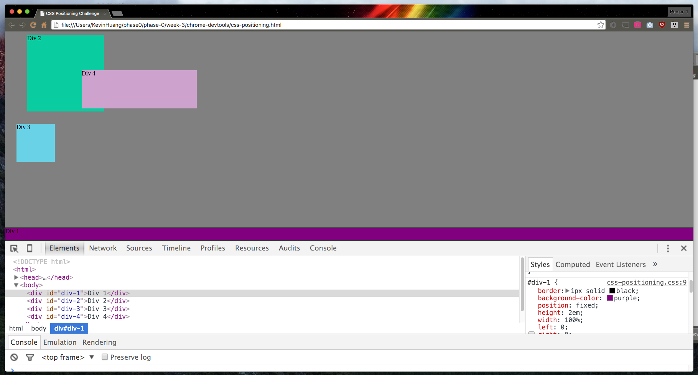
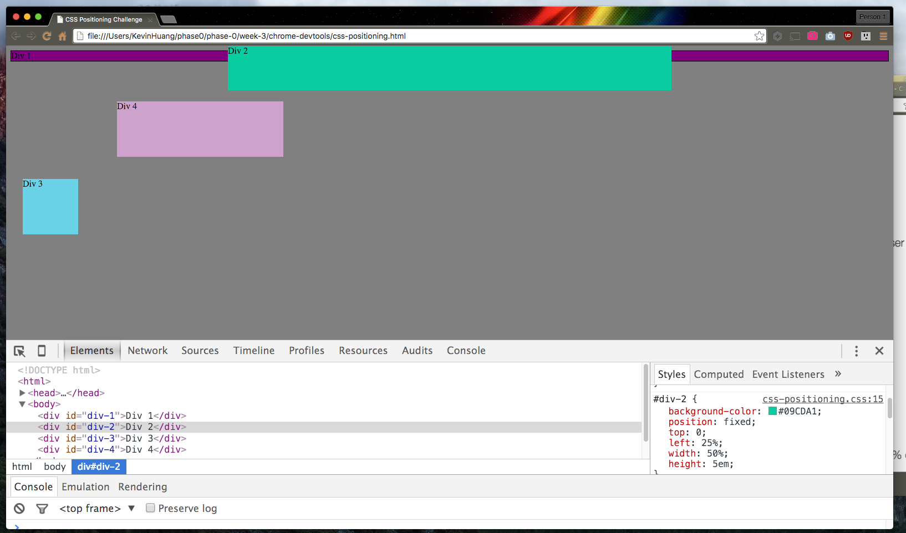
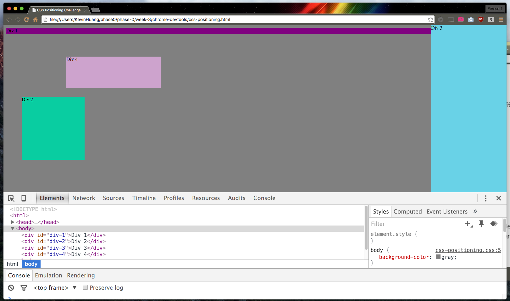
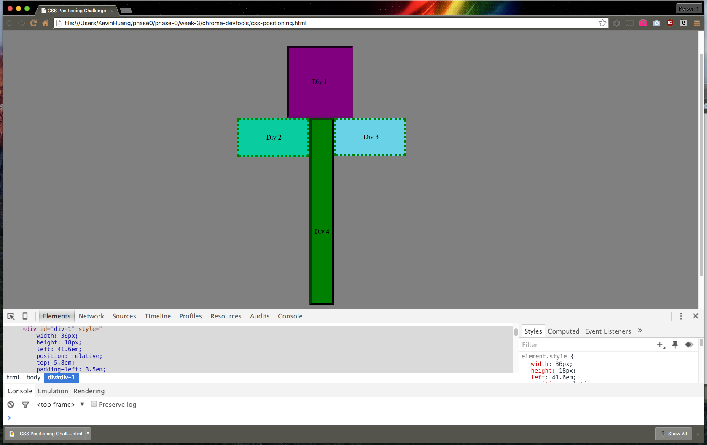

####Excercise 1 - Changes the Colors

####Excercise 2 - Column

####Excercise 3 - Rows

####Excercise 4 - Equidistance

####Excercise 5 - Squares

####Excercise 6 - Footer

####Excercise 7 - Header

####Excercise 8 - Sidebar

####Excercise 9 - Get Creative


####How can you use Chrome's DevTools inspector to help you format or position elements?

Chrome Devtools is great for helping you format & position elements because it allows you to experiment with element styling without having to actually change any code in your code base. All changes made within Chrome Devtools are temporary and can be erased by simply refreshing the page. This is a great resource especially for people trying to learn what specific CSS properties do by freeing beginners with the ability to make any changes they'd like to any page on their screen without incurring permanent chnages.

####How can you resize elements on the DOM using CSS?

You can resize elements in the DOM using CSS by interacting directly with the style column in Chrome Devtools. By using the style column in the DOM, you can directly add style properties to that specific element. To resize with CSS, you can use `height`, `width`, to directly change the size of the content area.


Here's an extra tip when it comes to resizing elements:
With the CSS box model, you can also change the size of the element's other areas, such as margin, border, and padding as well. Here are a few properties that can be used for resizing these specific areas:

`padding`
`padding-left`
`padding-right`
`padding-top`
`padding-bottom`
`border`
`border-width`
`margin`
`margin-left`
`margin-right`
`margin-top`
`margin-bottom`

####What are the differences between absolute, fixed, static, and relative positioning? Which did you find easiest to use? Which was most difficult?

The differences between absolute, fixed, static, and relative position are very very important! My pair and I devoted a large amount of time to experiementing with each position value to make sure that we KNEW what each meant.
Here's a breakdown of each position value:

`absolute` - Absolute positioning refers to making an HTML element assume an "absolute" position - meaning that the element will literally be positioned whereever you format and position it to be using additional CSS, regardless of other elements around it.
You would want absolute positioning if you wanted to ensure that a specific HTML element went to a specific location on the page, no matter what other elements might be in the way. Another property of the absolute positioning value is that it takes the HTML element out of the "flow" of the page completely. This means that this element will be taken out of the normal positioning structure of the page to FORCE this specific element's location. This also means that other elements will not try to stack or move around the element - this can cause overlap if you are not careful if absolute positioning. It can be very helpful for special elements on a page that need to be in specific locations.

`fixed` - Fixed positioning refers to making an HTML element assume a "fixed" position - one that will be "fixed" on your screen and stay in its current location on your screen, even if you scroll in any direction. Fixed uses sticks to a "viewpoint" (the position on the page on your screen when you first render it) and keeps the element at that specific viewpoint wheverever you scroll the page to.

`static` - Static positioning is the default value of all HTML elements. When static positioning is used, it displays HTML elements within the normal flow of the page. One interesting thing to note is that when you use other CSS formatting values to position the element while static, it will do so in relation to the page itself. Relative positioning (explained below) changes this attribute by making elements become relative to their current position in the flow of the page (rather than the margins of the full page)

`relative` - Relative positioning causes an HTML element to become "relative" to its own positioning. Instead of static positioning, which makes an element position itself in relation to the edges of the page itself, it will position itself relative to its position in the flow of the page. This makes relative positioning one of the most versatile positioning values because it allows you to cascade neighboring elements the way that you would want.

####What are the differences between margin, border, and padding?

In the CSS box model of HTML elements, each element has its own margin, border, and padding. Each of these three properties plays a part in formatting an HTML element.

Here is a text visualization of the box model that you can use to understand padding, border, and margin a bit better.

M - Margin edge
B - Border edge (- represents a solid border style)
P - Padding edge
C - Content edge

```
MMMMMMMMMMMMMMMMMMMMMMMMMMMMMMMMM
M                               M
M  BBBBBBBBBBBBBBBBBBBBBBBBBBB  M
M  B-------------------------B  M
M  B--PPPPPPPPPPPPPPPPPPPPP--B  M
M  B--P                   P--B  M
M  B--P   CCCCCCCCCCCC    P--B  M
M  B--P   C  Hello!  C    P--B  M
M  B--P   CCCCCCCCCCCC    P--B  M
M  B--P                   P--B  M
M  B--PPPPPPPPPPPPPPPPPPPPP--B  M
M  B-------------------------B  M
M  BBBBBBBBBBBBBBBBBBBBBBBBBBB  M
M                               M
MMMMMMMMMMMMMMMMMMMMMMMMMMMMMMMMM
```

`padding` refers to an area of space around the content that extends out to its border. You could think of padding as space within the box that pushes or extends the content internally.

`border` refers to the edge of the HTML element, extended from the padding area. The border box can be used to create an actual visual border that is rendered on the screen according to whatever color or style you specify for it.

`margin` refers to the outside spacing of the current HTML element. It extends out from the border area of the element and is used to space the element from its neighboring HTML elements.


####What was your impression of this challenge overall? (love, hate, and why?)

I thought the challenege was a lot of fun, however it was very tedious for a few excercises. My favorite excercise was the very last one where we were able to create whatever we wanted and experiment with every positioning and formatting value. It was in this excercise that absolute, relative, static, and fixed positioning were all solidified in my understanding of CSS. For fun, [I created a flower with CSS out of the 4 HTML elements.](imgs/Excercise9-GetCreative.png)

Overall, I loved the challenege because I felt like I was able to actually learn (and understand on a deep level) new concepts and try them out at the same time. I could feel my brain stretch to finish these excercises which was tiring and fulfilling at the same time.
