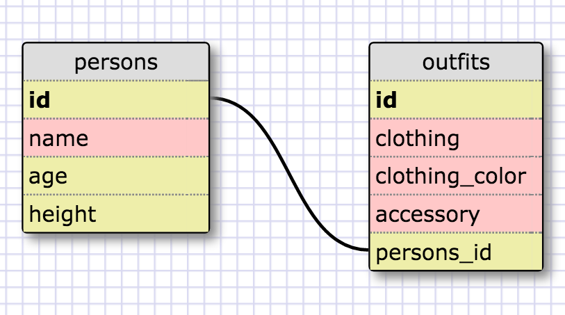

### 8.4 Introduction to Database Schemas and SQL
#### Reflection written by Kevin Huang
#### Challenge 1.
Select all data for all states.

`SELECT * FROM states;`

#### Challenge 2.
Select all data for all regions.

`SELECT * FROM regions;`

#### Challenge 3.
Select the `state_name` and `population` for all states.

`SELECT state_name, population FROM states;`

#### Challenge 4.
Select the `state_name` and `population` for all states ordered by `population`. The state with the highest population should be at the top.
```
SELECT  state_name, population FROM states 
ORDER BY population DESC;
```

#### Challenge 5.
Select the `state_name` for the states in region 7.
```
SELECT state_name FROM states 
WHERE region_id = 7;
```

#### Challenge 6.
Select the `state_name` and `population_density` for states with a population density over 50 ordered from least to most dense.
```
SELECT state_name, population_density FROM states 
WHERE population_density > 50  ORDER BY population_density;
```

#### Challenge 7.
Select the `state_name` for states with a population between 1 million and 1.5 million people.
```
SELECT state_name from states
WHERE population < 1500000 AND population > 1000000;
```

#### Challenge 8.
Select the `state_name` and `region_id` for states ordered by region in ascending order.
```
SELECT state_name, region_id from states
ORDER BY region_id ASC;
```

#### Challenge 9. 
Select the `region_name` for the regions with "Central" in the name.
```
SELECT region_name FROM regions
WHERE region_name LIKE "%Central%";
```

#### Challenge 10.
Select the `region_name` and the `state_name` for all states and regions in ascending order by `region_id`. Refer to the region by name. (This will involve joining the tables).
```
SELECT region_name, state_name
FROM states, regions
WHERE REGIONS.ID = STATES.REGION_ID
ORDER BY region_id ASC;
```

#### Release 6: Your own schema



####What are databases for?

Databases are meant for organizing collections of data to be easily accessed, modified, and written. 
SQL databases make working with large collections of data much easier than with the data structures natively available to Ruby and other languages such as arrays and hashes, which can become difficult to access when several layers of complexity and quantity are needed in the data.

####What is a one-to-many relationship?

A one-to-many relationship is characterized by an object that might belong to a certain category, however that category will have many similar objects within. 

A good way to think of a one-to-many relationship by using the sentence : ____ belongs to a ____. ____ has many ____.

####What is a primary key? What is a foreign key? How can you determine which is which?

A primary key is a unique identifier for each record in a table. Primary keys can be used in tandem with foreign keys to link tables within a relational database.

A foreign key is a field in one table that uniquely identifies a row in another table. They can be used and linked with a primary key to link resources between tables within a relational database.

####How can you select information out of a SQL database? What are some general guidelines for that?

You can select information out of an SQL database by using the SELECT clause.
The SELECT clause follows a specific syntax that follows the following form:
`SELECT * FROM table_name;`
where * refers to the entire table. 

You can replace * with any column name to select from that specific column like so:
`SELECT state_name, region_id FROM states;`

Commas are used with the SELECT clause to specify multiple columns to select within a schema.
